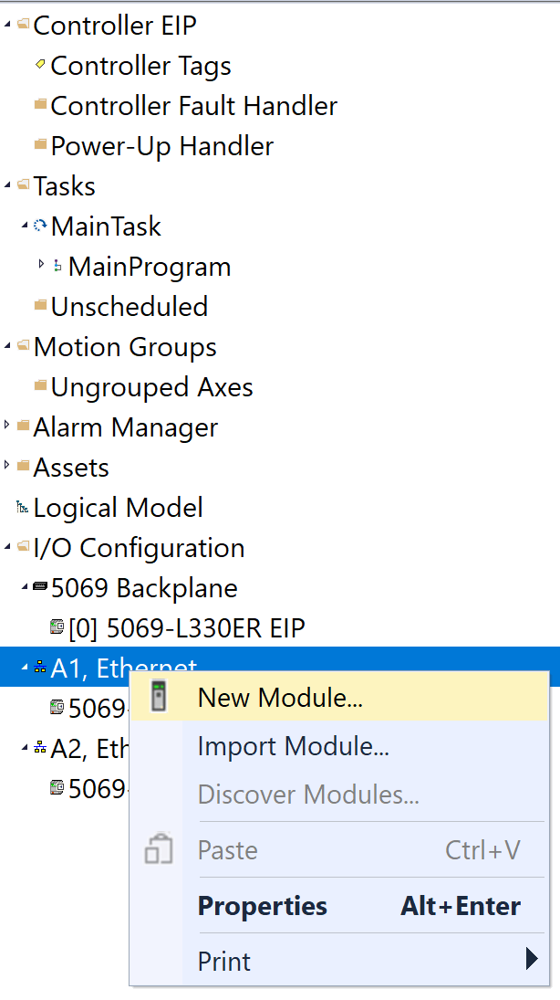
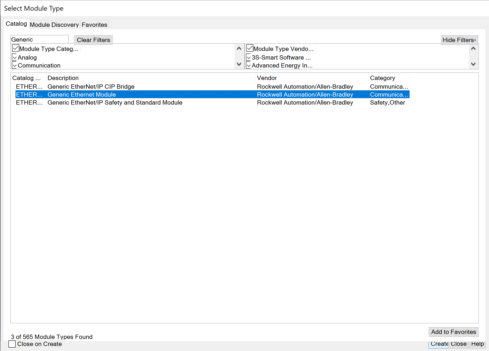
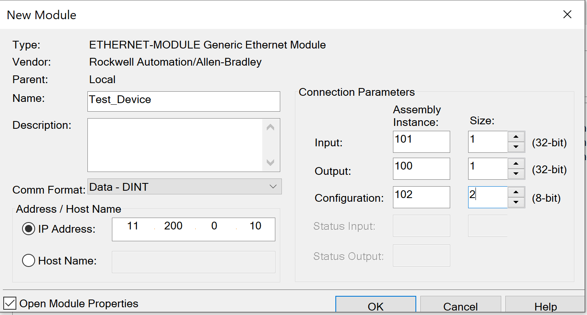
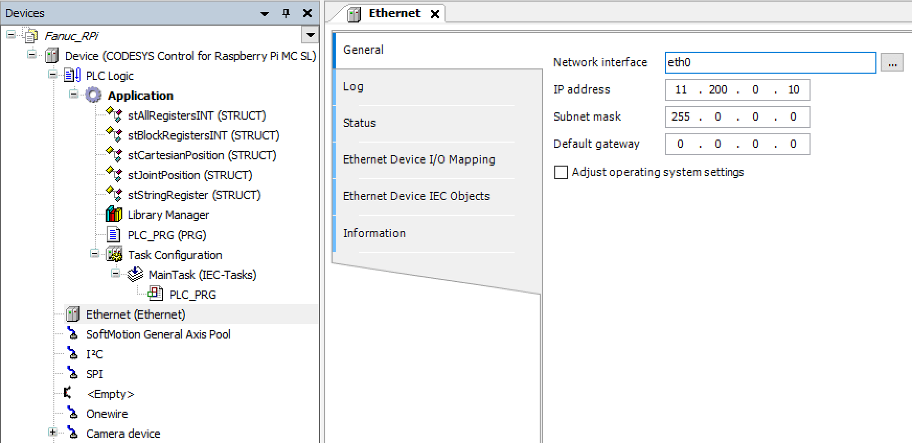
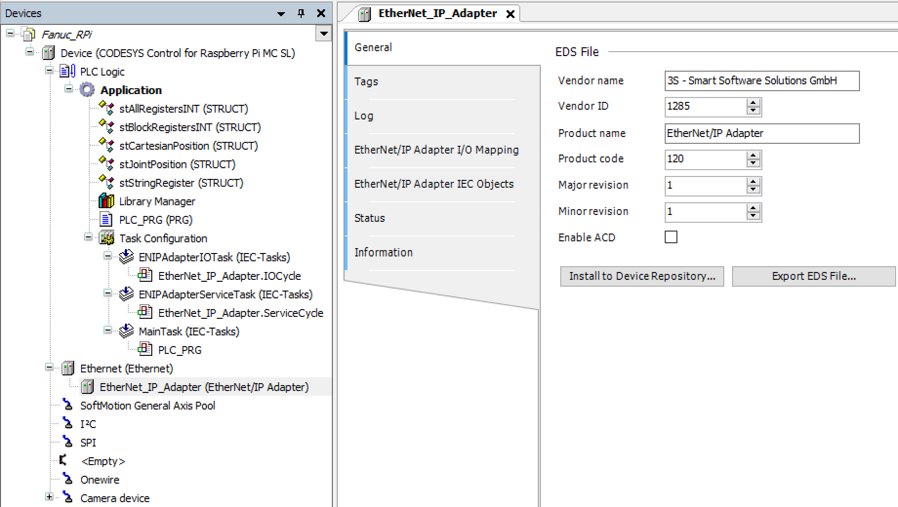
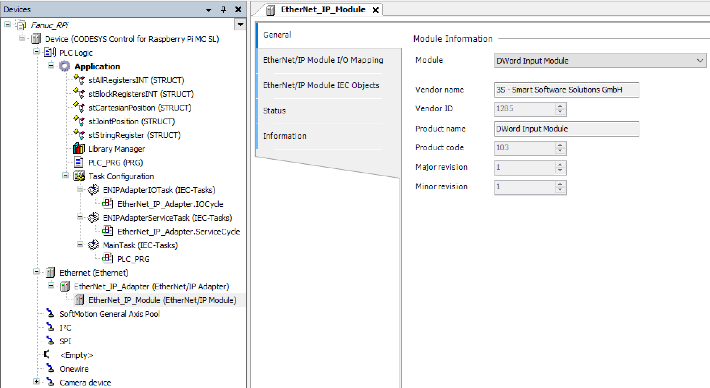
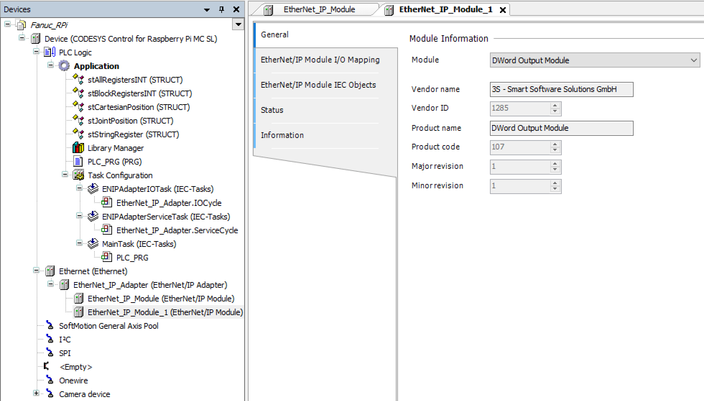

# Set up Discrete I/O Communication
Quick tutorial on how to set up I/O between your CoDeSys controller and the Rockwell PLC using implicit messaging.  Rockwell forces its PLCs to be in scanner mode (master).
    
### Rockwell Scanner <=> CoDeSys Adapter

#### Rockwell
1) 
    1) Right click on the Ethernet bus and click `New Module`
2) 
    1) On the top right box, type `Generic` to filter the list.
    2) Select `Generic Ethernet Module`
3) 
    1) Double click on the newly added module and fill in the information.
        1) For `Address / Host Name`, enter the IP address of the CoDeSys controller
        2) The input assembly is `101`, the output is `100`, and configuration is `102`
        3) Size column shows how many bytes are to be exchanged.  The example uses `32-bit` (4 bytes), but you could always change to `8-bit` or `16-bit`.
            1) Adjust this number up to about 500 bytes total.

#### CoDeSys
1) 
    1) Right click on your controller device (e.g. CODESYS Control for Raspberry Pi MC SL)
        1) Select `Add device`
        2) Expand `Ethernet Adapter` and select `Ethernet`
        3) Click `Add Device`
    2) Double click the newly added `Ethernet (EtherNet)` device
        1) In the `General` tab, press `...` to select the controller's Ethernet network interface
2) 
    1) Right click the newly added `Ethernet (Ethernet)` device
        1) Select `Add device`
        2) Expand `EtherNet/IP` -> `EtherNet/IP Local Adapter` and select `EtherNet/IP Adapter`
        3) Click `Add Device`
3) 
    1) Right click the newly added `Ethernet_IP_Adapter (EtherNet/IP Adapter)` device
        1) Select `Add device`
        2) Select `EtherNet/IP Module`
        3) Click `Add Device`
    2) Double click on the newly added `EtherNet_IP_Module (EtherNet/IP Module)` device
        1) In the `General` tab, select the Module type.  Example sends 4 bytes, so select `DWord Input Module`
4) 
    1) Repeat steps 3 for `DWord Output Module`